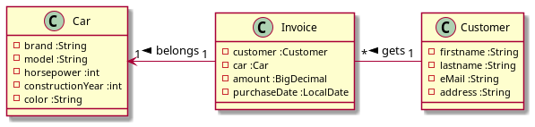
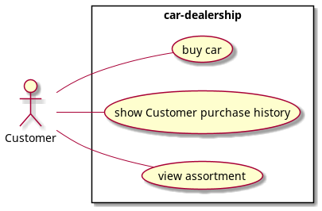

# microproject moritz polleichtner

## Car-Dealer

### idea of the project
- the idea of my project is a small simple car-dealer, who sells 
cars to customer and give them bills

- the customer can review all bills of his previous purchases and have a look at the 
dealership assortment of the dealership, and of course buy a car

### implementation

- a little rest service was created, where CRUD-methods are implemented

- the application is tested with assertj and restassured

### diagrams
 
#### class

#### use case 

1. as an user I want to buy a car
2. as an user I want to get a overview of my previous purchases
3. as an user i want to have a look on the dealerships assortment

- [x] Tables and Annotations
- [x] QueryParam
- [x] PathParam
- [x] GET-Request
- [x] POST-Request
- [x] PUT-Request
- [ ] PATCH-Request
- [x] Request.http (with the endpoints to make the user stories work)
- [x] Readme
- [x] UseCase
- [x] Swagger Documentation
- [x] Swagger Documentation for Endpoints
- [x] Checklist
